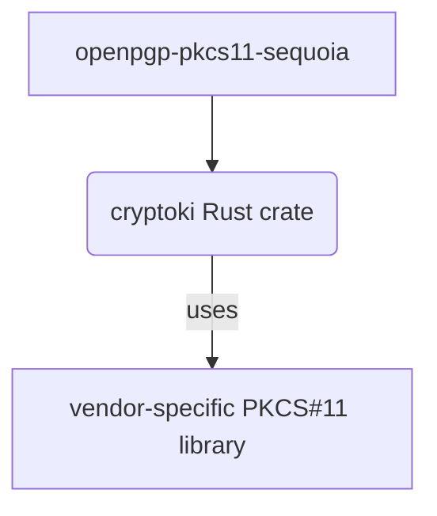

# openpgp-pkcs11-sequoia

A library to use PKCS #&#8203;11 devices in an OpenPGP context.

[PKCS #&#8203;11](https://en.wikipedia.org/wiki/PKCS_11) refers to a
programming interface to create and manipulate cryptographic tokens.

(See [openpgp-pkcs11-tools](https://crates.io/crates/openpgp-pkcs11-tools)
for a CLI tool based on this library.)

## PKCS #&#8203;11 specification

[PKCS #11 Cryptographic Token Interface
Base Specification Version 2.40,
OASIS Standard,
14 April 2015](http://docs.oasis-open.org/pkcs11/pkcs11-base/v2.40/os/pkcs11-base-v2.40-os.pdf)

[PKCS #11 v2.20: Cryptographic Token Interface Standard,
RSA Laboratories,
28 June 2004](https://www.cryptsoft.com/pkcs11doc/STANDARD/pkcs-11v2-20.pdf)

## PKCS #&#8203;11 access libraries

Accessing PKCS #&#8203;11 devices requires a (typically vendor-specific)
PKCS #&#8203;11 dynamic library implementation ("module").
For example, to access the Yubikey PIV application on a Yubikey 5,
`/usr/lib64/libykcs11.so` can be used.

The code in this repository uses [cryptoki](https://crates.io/crates/cryptoki),
a "high-level, Rust idiomatic wrapper crate for PKCS #&#8203;11" as a wrapper for these modules:

# Devices and software implementations

## YubiKey 4/5 (ykcs11)

### Key upload limitation

The YubiKey PKCS #&#8203;11 driver
([`ykcs11`](https://developers.yubico.com/yubico-piv-tool/YKCS11/)) appears
to not implement the required functionality to upload key material
(uploading `CKO_PUBLIC_KEY` objects is unsupported, but would be needed).

Thus, keys can currently only be uploaded to these cards via the PIV
interface.

## Nitrokey HSM 2 / SmartCard-HSM-4K

https://www.smartcard-hsm.com/opensource.html

"The SmartCard-HSM is supported by OpenSC, a PKCS#11 and CSP Minidriver middleware for various operating systems."

(https://support.nitrokey.com/t/differences-between-nitrokey-hsm2-smartcard-hsm-4k-usb-token/1985)

## YubiHSM 2

https://developers.yubico.com/YubiHSM2/Usage_Guides/YubiHSM_quick_start_tutorial.html

## Nitrokey NetHSM

Available as container image (no security features, just for testing purposes!):

https://hub.docker.com/r/nitrokey/nethsm

PKCS #&#8203;11 driver: https://github.com/Nitrokey/nethsm-pkcs11

"This driver is still an early Proof of Concept implementation that only implements the functions that are necessary
for operating TLS servers"

## Utimaco SecurityServer simulator

https://utimaco.com/downloads/simulators-and-sdks/securityserver-simulator

(Presumably under a non-free license; so, possibly can't be used in CI openly (?))

## SoftHSM2

A software implementation of PKCS #&#8203;11.

https://github.com/opendnssec/SoftHSMv2
